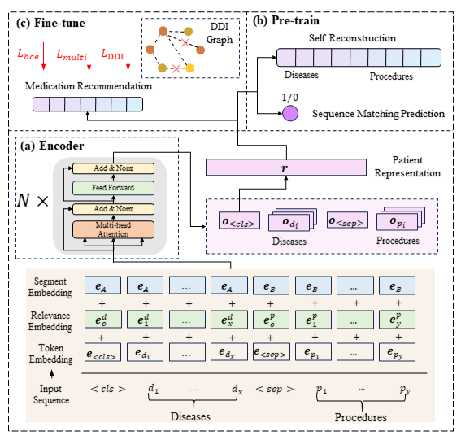

# Leave No Patient Behind: Enhancing Medication Recommendation for Rare Disease Patients

[](https://github.com/zzhUSTC2016/RAREMed/blob/main/LICENSE)

<div style="text-align: center;">

</div>


This repository provides the official PyTorch implementation and reproduction for our **SIGIR'24** paper titled **"Leave No Patient Behind: Enhancing Medication Recommendation for Rare Disease Patients"**. 

More descriptions are available via the [paper](https://arxiv.org/abs/2403.17745).
<!-- and the [slides](https://cdn.chongminggao.top/files/pdf/DORL-slides.pdf), and this Chinese [Zhihu Post](https://zhuanlan.zhihu.com/p/646690133). -->


If this work helps you, please kindly cite our papers:

```tex
@article{zhao2024leave,
  title={Leave No Patient Behind: Enhancing Medication Recommendation for Rare Disease Patients},
  author={Zhao, Zihao and Jing, Yi and Feng, Fuli and Wu, Jiancan and Gao, Chongming and He, Xiangnan},
  journal={arXiv preprint arXiv:2403.17745},
  year={2024}
}
```

## Installation

1. Clone this git repository and change directory to this repository:

   ```shell
   git clone https://github.com/zzhUSTC2016/RAREMed.git
   cd RAREMed/
   ```

2. A new [conda environment](https://docs.conda.io/projects/conda/en/latest/user-guide/concepts/environments.html) is suggested. 

   ```bash
   conda create --name RAREMed
   ```

3. Activate the newly created environment.

   ```bash
   conda activate RAREMed
   ```

4. Install the required modules.

   ```bash
   sh install.sh
   ```


## Download the data

1. You must have obtained access to [MIMIC-III](https://physionet.org/content/mimiciii/) and [MIMIC-IV](https://physionet.org/content/mimiciv/) databases before running the code. 

2. Download the MIMIC-III and MIMIC-IV datasets, then unzip and put them in the `data/input/` directory. Specifically, you need to download the following files from MIMIC-III: `DIAGNOSES_ICD.csv`, `PRESCRIPTIONS.csv`, and `PROCEDURES_ICD.csv`, and the following files from MIMIC-IV: `DIAGNOSES_ICD.csv`, `PRESCRIPTIONS.csv`, and `PROCEDURES_ICD.csv`.

3. Download the [drugbank_drugs_info.csv](https://drive.google.com/file/d/1EzIlVeiIR6LFtrBnhzAth4fJt6H_ljxk/view?usp=sharing) and [drug-DDI.csv]( https://drive.google.com/file/d/1mnPc0O0ztz0fkv3HF-dpmBb8PLWsEoDz/view?usp=sharing) files, and put them in the `data/input/` directory.

## Preprocess the data

Run the following command to preprocess the data:

```bash
python preprocess.py
```

If things go well, the processed data will be saved in the `data/output/` directory. You can run the models now!

## Run the models

```bash
usage: main_RAREMed.py [-h] [-n NOTE] [--model_name MODEL_NAME] [--dataset DATASET] [--early_stop EARLY_STOP] [-t] [-l LOG_DIR_PREFIX] [-p PRETRAIN_PREFIX] [--cuda CUDA] [-s] [-e] [-nsp] [-mask] [--pretrain_epochs PRETRAIN_EPOCHS] [--mask_prob MASK_PROB] [--embed_dim EMBED_DIM] [--encoder_layers ENCODER_LAYERS] [--nhead NHEAD] [--batch_size BATCH_SIZE] [--adapter_dim ADAPTER_DIM] [--lr LR] [--dropout DROPOUT] [--weight_decay WEIGHT_DECAY] [--weight_multi WEIGHT_MULTI] [--weight_ddi WEIGHT_DDI]

RAREMed model training and evaluation script

optional arguments:
  -h, --help            show this help message and exit
  -n NOTE, --note NOTE  User notes
  --model_name MODEL_NAME
                        model name (default: 'RAREMed')
  --dataset DATASET     dataset (default: 'mimic-iii')
  --early_stop EARLY_STOP
                        early stop after this many epochs without improvement (default: 10)
  -t, --test            test mode
  -l LOG_DIR_PREFIX, --log_dir_prefix LOG_DIR_PREFIX
                        log dir prefix like "log0", for model test (default: None)
  -p PRETRAIN_PREFIX, --pretrain_prefix PRETRAIN_PREFIX
                        log dir prefix like "log0", for finetune (default: None)
  --cuda CUDA           which cuda (default: 6)
  -s, --patient_seperate
                        whether to combine diseases and procedures
  -e, --seg_rel_emb     whether to use segment and relevance embedding layer (default: True)
  -nsp, --pretrain_nsp  whether to use nsp pretrain
  -mask, --pretrain_mask
                        whether to use mask prediction pretrain
  --pretrain_epochs PRETRAIN_EPOCHS
                        number of pretrain epochs (default: 20)
  --mask_prob MASK_PROB
                        mask probability (default: 0)
  --embed_dim EMBED_DIM
                        dimension of node embedding (default: 512)
  --encoder_layers ENCODER_LAYERS
                        number of encoder layers (default: 3)
  --nhead NHEAD         number of encoder head (default: 4)
  --batch_size BATCH_SIZE
                        batch size during training (default: 1)
  --adapter_dim ADAPTER_DIM
                        dimension of adapter layer (default: 128)
  --lr LR               learning rate (default: 1e-5)
  --dropout DROPOUT     dropout probability of transformer encoder (default: 0.3)
  --weight_decay WEIGHT_DECAY
                        weight decay (default: 0.1)
  --weight_multi WEIGHT_MULTI
                        weight of multilabel margin loss (default: 0.005)
  --weight_ddi WEIGHT_DDI
                        weight of ddi loss (default: 0.1)
```

Example:

```bash
python main_RAREMed.py -nsp -mask    # pretrain and train
python main_RAREMed.py -t -l=log0    # test
```

For Baselines:

```bash
python main_GBert_pretrain.py
python main_GBert.py -p=0
python main_GBert.py -t -l=log1
```

```bash
python main_GAMENet.py
python main_GAMENet.py -t -l=log0
```

## Acknowledgement

Thanks to [Jing Yi(井怡)](https://jingii.github.io/) for her help in the implementation of the RAREMed model.
This repository is partially based on the [SafeDrug](https://github.com/ycq091044/SafeDrug) repository, you can find some additional details in the original repository.

Welcome to contact me zzh1998@mail.ustc.edu.cn for any question.
