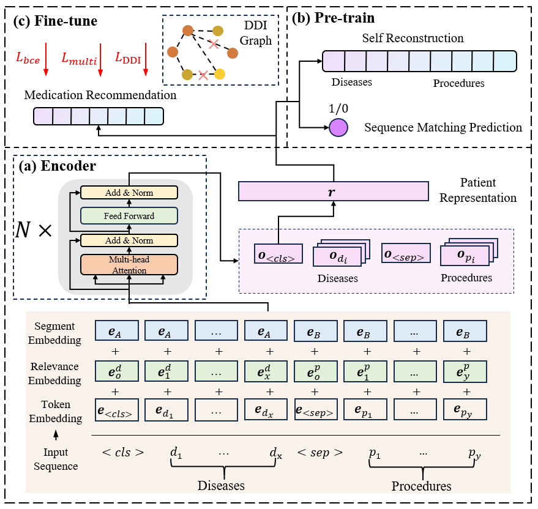

# Leave No Patient Behind: Enhancing Medication Recommendation for Rare Disease Patients

[](https://github.com/zzhUSTC2016/RAREMed/blob/main/LICENSE)

<div style="text-align: center;">

</div>


This repository provides the official PyTorch implementation and reproduction for our **SIGIR'24** paper titled **"Leave No Patient Behind: Enhancing Medication Recommendation for Rare Disease Patients"**. 

More descriptions are available via the [paper](https://arxiv.org/abs/2403.17745).
<!-- and the [slides](https://cdn.chongminggao.top/files/pdf/DORL-slides.pdf), and this Chinese [Zhihu Post](https://zhuanlan.zhihu.com/p/646690133). -->


If this work helps you, please kindly cite our papers:

```tex
@article{zhao2024leave,
  title={Leave No Patient Behind: Enhancing Medication Recommendation for Rare Disease Patients},
  author={Zhao, Zihao and Jing, Yi and Feng, Fuli and Wu, Jiancan and Gao, Chongming and He, Xiangnan},
  journal={arXiv preprint arXiv:2403.17745},
  year={2024}
}
```

